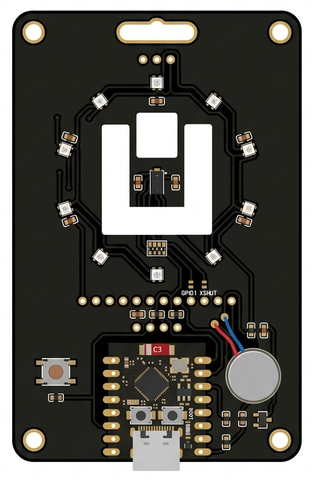
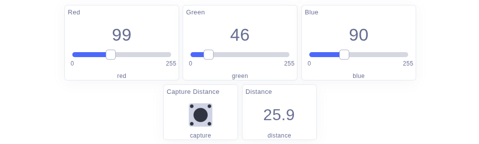

# Uniot Promo Badge

<div align="center">
  
</div>

A conference badge that is also a working IoT device: an ESP32-C3 with a ring of ten RGB LEDs,
a time-of-flight distance sensor, a vibration motor and a button.

What the badge *does* is not fixed in the firmware. It runs [Uniot Core](https://github.com/uniot-io/uniot-core),
which carries a small Lisp interpreter, so its behaviour is a script you write in the Uniot app
and deploy over the air — no cable, no reflashing, and the badge keeps the script across
reboots.

The firmware itself installs and updates from a browser, too: plug the badge in and open
**[install.uniot.io](https://install.uniot.io)**.

## Start with the QR code

On the back of the badge is a QR code with a promo code behind it. Activating it puts the
[example](#the-example) — a script and a dashboard to drive it — into your account, and raises
your limits by one dashboard, one script and one device, which you can spend on the badge or on
anything else.

You don't have to use either. The example is a starting point: edit it, replace it, or write
your own from scratch and deploy that instead.

## Hardware

| GPIO | Part |
| --- | --- |
| 5 | Ring of 10 WS2812 LEDs (`NEO_RGB`, 800 kHz) |
| 8 | I²C SDA — VL53L0X distance sensor |
| 9 | I²C SCL — VL53L0X distance sensor |
| 3 | Button |
| 10 | Vibration motor |
| 1 | Sensor `XSHUT` — wired and labelled, unused by the firmware |

The brain is an ESP32-C3 SuperMini, powered and programmed over USB-C. GPIO 8 does double duty:
it is the sensor's SDA line and also the pin the firmware blinks for WiFi status.

## What scripts can reach

The firmware exposes the peripherals to scripts as primitives, on top of everything Uniot Core
already provides (`task`, `push_event`, `pop_event`, `is_event`, …):

| Primitive | Returns | Does |
| --- | --- | --- |
| `(pixel_set p r g b)` | Bool | Stages LED `p` (0-9) at that colour; each channel 0-255 |
| `(pixel_clear)` | Bool | Stages every LED off |
| `(pixel_show)` | Bool | Pushes the staged colours to the ring |
| `(tof_distance)` | Int | Distance in millimetres, averaged over the last few samples |
| `(vibro n)` | Bool | Buzzes `n` times, ~70 ms per pulse |
| `(bclicked 0)` | Bool | True once for each click of the button |
| `(dread 0)` | Bool | The button's raw level |
| `(dwrite 0 v)` | Bool | Drives the vibration motor directly |

Nothing is drawn until `pixel_show` — set the LEDs you want, then show them once.

`tof_distance` reads 0 until the sensor has produced its first sample, and starts a measuring
window that stays open for ten seconds, so calling it from a repeating task keeps it fed.

## The example

<div align="center">
  
</div>

The script runs every 80 ms and does four things:

- reads the distance and maps 40-360 mm onto the ten LEDs
- draws either one LED or a filled bar, depending on a flag the button toggles
- takes `red`, `green` and `blue` from the dashboard sliders
- answers a `capture` event with the current distance

It arrives in your account as blocks, which is where it is easiest to change. The text behind
them is in [docs/badge-example.lisp](docs/badge-example.lisp) if you would rather read or edit
it that way.

### Its dashboard

<div align="center">
  
</div>

A script and the app talk to each other through named events, and each widget binds to one:

| Widget | Event | Direction |
| --- | --- | --- |
| Slider | `red` | app → badge, 0-255 |
| Slider | `green` | app → badge, 0-255 |
| Slider | `blue` | app → badge, 0-255 |
| Push button | `capture` | app → badge, asks for a reading |
| Value | `distance` | badge → app, the captured distance |

The sliders are set to *retain*, so the colour survives a reconnect. The distance readout
divides by ten and shows one decimal, which turns the millimetres the script sends into
centimetres.

In a script, `push_event` sends a value up to the dashboard; `is_event` and `pop_event` read
what came down.

## Installing the firmware

### In your browser

Open **[install.uniot.io](https://install.uniot.io)** in desktop Chrome, Edge or Opera, plug
the badge in with a USB-C cable, and press *Connect*. The page shows which firmware the badge
is running and which is available, installs or updates it, and checks afterwards that the new
version started. Nothing to install on your computer.

An update keeps the badge's WiFi settings, identity and script. Erasing is there if you want
it, but only if you tick it. A serial console under the page shows the badge's log while it
works, and *Test the hardware instead* installs the hardware test described below.

### From a release

Every [release](https://github.com/uniot-io/uniot-promo-badge-firmware/releases) carries one
image per build, merged so it goes on at offset 0:

```bash
esptool.py --chip esp32c3 write_flash 0x0 compatible.bin
```

Without an erase, this also keeps the badge's settings.

### From source

A [PlatformIO](https://platformio.org/) project:

| Environment | Release image | What it is |
| --- | --- | --- |
| `uniot_app` | `compatible.bin` | The badge firmware — this is the one you want |
| `uniot_app_full_range` | `full-range.bin` | The same, at full WiFi transmit power — see below |
| `factory_test` | `hardware-test.bin` | Assembly check, no account needed — see below |
| `uniot_sleep_example` | — | Deep sleep with wake-on-button, kept as a reference |

```bash
pio run -e uniot_app -t upload
pio device monitor
```

### Which radio build

Some ESP32-C3 modules can't hold a WiFi connection at the chip's full transmit power, and
nothing on the board tells them apart. *Compatible* transmits at 8.5 dBm instead of 19.5,
which works on every module at a shorter range; it's what badges ship with. *Full range*
keeps full power, for a module whose radio copes — if it never connects, install
*Compatible* instead. Switching keeps your WiFi settings, identity and script.

### The hardware test

The fastest way to tell working hardware from a bad solder joint: it sweeps the ring, buzzes,
then tries the sensor. If the sensor answers, the ring tracks your hand as a red arc — all
red closer than 40 mm, all blue past 360 mm; if it doesn't, a red dot chases around the ring
instead. The button drives the motor throughout, so all four peripherals are covered without
a network or an account. Install the firmware again afterwards; the badge keeps its settings.

### How a badge says what it's running

The firmware names itself in one line — at boot, and whenever `UNIOT?` arrives on the serial
port. That's how the installer tells an update from a new install, and which radio build a
badge already has:

```
UNIOT device=badge version=1.0.0 core=0.9.0 lisp=0.4.0 variant=compatible
```

To ask by hand, open `pio device monitor`, type `UNIOT?` and press Enter — nothing echoes as
you type, but the answer does.

## Building one without a badge

Nothing here is specific to the PCB. On a breadboard you need:

| Part | Notes |
| --- | --- |
| ESP32-C3 board | The badge uses a C3 SuperMini; any C3 with the pins below works |
| 10 WS2812 LEDs | A ring or a strip; any length, if you change `LED_COUNT` |
| VL53L0X module | The usual breakout, over I²C |
| Coin vibration motor | Plus a driver — see below |
| Momentary button | To ground |

Wire them to the GPIOs in [Hardware](#hardware), or to whichever pins suit you: they are all
`#define`s at the top of [src/uniot_app/main.cpp](src/uniot_app/main.cpp), and the rest of the
firmware follows from them. Three things the board handles for you that a breadboard doesn't:

- **The motor needs a driver.** It pulls more current than a GPIO can source, so drive it
  through a small NPN or a logic-level MOSFET, with a flyback diode across the motor. Wiring it
  straight to GPIO 10 will eventually take the pin, or the chip, with it.
- **The LEDs want their own supply.** Give the ring 5 V and the data line stays out of spec
  from a 3.3 V pin; it usually works, and a level shifter — or running the ring at 3.3 V —
  makes it reliable.
- **I²C needs pull-ups**, which nearly every VL53L0X breakout already has. `XSHUT` can be left
  unconnected; the firmware doesn't use it.

The button can be any pin that survives boot: `configWiFiResetButton` chooses the internal pull
from the active level, so no external resistor is needed.

The [web installer](https://install.uniot.io) works for your build too, as long as it uses the
badge's pins: it installs the released images, and those have the pins built in. It finds
boards with the USB-serial chips common on ESP32 development boards, not only the C3's own
USB. If you moved any pins, build [from source](#from-source) instead.

## First run

1. Power the badge. With no WiFi stored, it opens an access point named `UNIOT-…`; join it and
   a captive portal appears.
2. Enter your WiFi credentials and your Uniot account id, then let it connect.
3. Claim the badge in the app and deploy a script to it — the
   [getting started guide](https://docs.uniot.io/guides/getting-started) walks through it.

The button also manages the network once the badge is running:

- **press and hold** — reconnect
- **click four times, then press and hold** — forget the stored WiFi credentials and reopen the
  portal

## License

GPL-3.0, the same as [uniot-core](https://github.com/uniot-io/uniot-core) — see
[LICENSE](LICENSE).

## Built with

[uniot-core](https://github.com/uniot-io/uniot-core) (the platform), and Adafruit's
[NeoPixel](https://github.com/adafruit/Adafruit_NeoPixel) and
[VL53L0X](https://github.com/adafruit/Adafruit_VL53L0X) libraries for the ring and the sensor.
